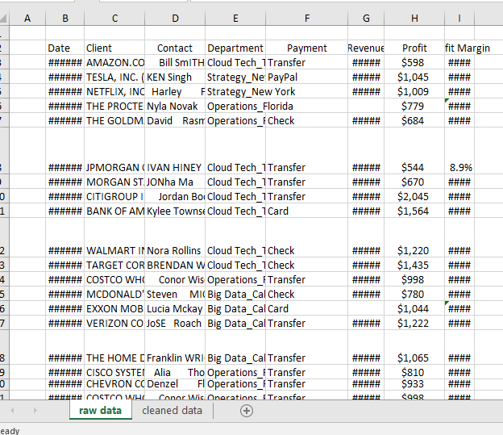
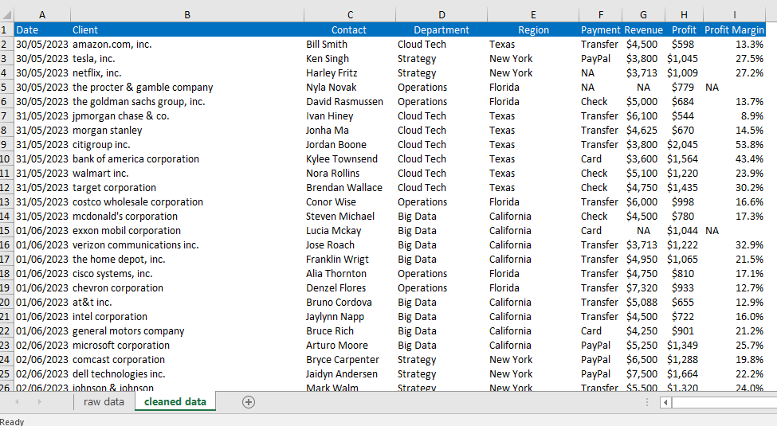

# 📊 Excel Data Cleaning Project

## Overview

This project demonstrates the process of cleaning and preparing a messy dataset using **Microsoft Excel**. The workbook contains both the **Raw Data** and **Cleaned Data** worksheets, showcasing the transformation of raw data into a clean, structured, and analysis-ready dataset.

---

## 📄 Project

The Excel workbook contains:

- **Raw Data** – Original dataset before cleaning
- **Cleaned Data** – Dataset after applying data cleaning techniques

---

## 🛠 Data Cleaning Techniques Applied

- AutoFit Rows & Columns
- Find & Replace
- Removed unwanted characters
- Standardized text using:
  - `TRIM()`
  - `LOWER()`
  - `PROPER()`
- Split data using **Text to Columns**
- Removed duplicate records
- Handled missing values
- Used `IFERROR()` to handle formula errors
- Applied formatting for improved readability

---

## 📷 Before vs After

### Raw Dataset

  

### Cleaned Dataset

  

---

## 💡 Skills Demonstrated

- Microsoft Excel
- Data Cleaning
- Data Preparation
- Data Quality Improvement
- Data Standardization
- Excel Functions
- Spreadsheet Formatting

---

## 🎯 Key Learning Outcomes

- Cleaned and standardized inconsistent data
- Removed duplicate records
- Handled missing values
- Applied Excel functions for data transformation
- Improved data quality for analysis and reporting
- Organized datasets using Excel best practices

---

## 🧰 Tools Used

- Microsoft Excel

---

## 🚀 Outcome

Successfully transformed a messy dataset into a clean, consistent, and analysis-ready format using Microsoft Excel's built-in tools and functions.
